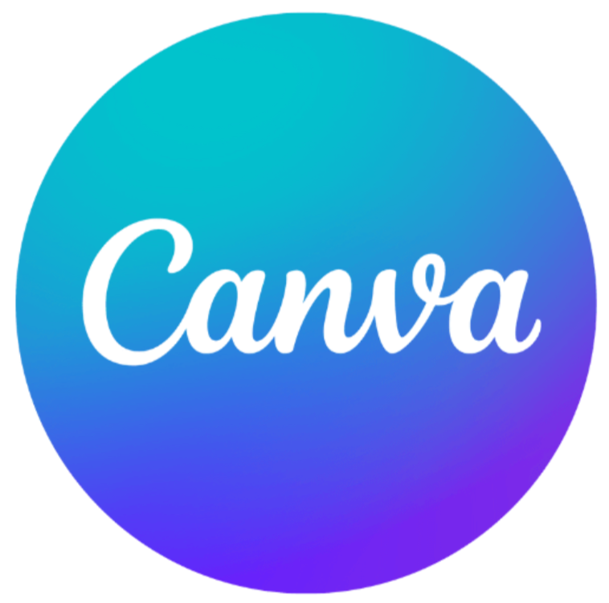

<!---
alonepranav/alonepranav is a ✨ special ✨ repository because its `README.md` (this file) appears on your GitHub profile.
You can click the Preview link to take a look at your changes.
--->
 
<h2>Hey 👋, I'm Pranav </h2>
  
- I’m a **Student** and **Developer** like to build web applications.

- I also have a strong interest in UI/UX design, having worked on visuals using **Canva**.

- 😇 Here, I keep my **codes**, **projects**, and other stuff.

 

🌱 I’m currently doing an internship and learning new things.  
  
#### **🔗 Projects Website** : <a href="https://projects-by-pranav.vercel.app">https://projects-by-pranav.vercel.app</a>  

## 👨‍💻 ➡️ 

&nbsp;&nbsp;
&nbsp;&nbsp;
&nbsp;&nbsp;
&nbsp;&nbsp;

&nbsp;&nbsp;
&nbsp;&nbsp;
&nbsp;&nbsp;
&nbsp;&nbsp;
&nbsp;&nbsp;
&nbsp;&nbsp;
&nbsp;&nbsp;
&nbsp;&nbsp;
&nbsp;&nbsp;
&nbsp;&nbsp;
&nbsp;&nbsp;
&nbsp;&nbsp;
&nbsp;&nbsp;
&nbsp;&nbsp;
&nbsp;&nbsp;
&nbsp;&nbsp;
 

## 📊 GitHub Stats :

    

        
    

    

        
    

<!-- 
🌠Connect with me 

  -->
