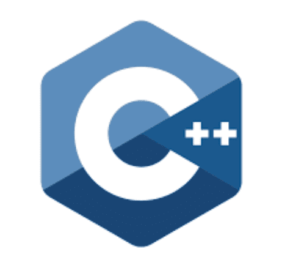

<!---
alonepranav/alonepranav is a ✨ special ✨ repository because its `README.md` (this file) appears on your GitHub profile.
You can click the Preview link to take a look at your changes.
--->

<h2>Hi, I am Pranav 👋</h2>

- 🧑‍💻 I am a Web Developer

- 🌱 I’m currently working on projects.
- 😇 Here, I keep my codes, projects, web apps, API, and coding stuff.
- 📫 How to reach me : send me a 👉<a href="mailto:pranavshilavane1@gmail.com">**Email 📩**</a> 👈

<h4><a href="/">🔗 My portfolio Website is coming soon</a></h4>

<h4><a href="https://project-pranav.web.app">🔗 My Project Showcase website</a></h4>

<h3 align="left">Languages and Tools:</h3>    

&nbsp;
&nbsp;
&nbsp;
&nbsp;
&nbsp;
&nbsp;
&nbsp;
&nbsp;
&nbsp;
&nbsp;
&nbsp;
&nbsp;
&nbsp;
&nbsp;
&nbsp;

<h3 align="left">Connect with me:</h3>

- Replit : &nbsp;&nbsp; **<a href="https://replit.com/@pranavshilavane" target="_blank">@PranavShilavane</a>**
- Github : &nbsp;&nbsp; **<a href="https://github.com/pranavshilavane" target="_blank">@PranavShilavane</a>**
- Instagram : &nbsp;&nbsp; **<a href="https://instagram.com/pranavshilavane" target="_blank">@PranavShilavane</a>**
- Linkedin : &nbsp;&nbsp; **<a href="https://www.linkedin.com/in/pranav-shilavane-9245b8236/" target="_blank">@PranavShilavane</a>**
- Twitter : &nbsp;&nbsp; **<a href="https://twitter.com/pranavshilavane" target="_blank">@PranavShilavane</a>**

 
 
 

&nbsp;

<!--

 -->
