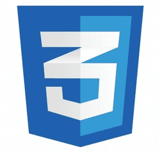

<!---
alonepranav/alonepranav is a ✨ special ✨ repository because its `README.md` (this file) appears on your GitHub profile.
You can click the Preview link to take a look at your changes.
--->

<h1 align="center">Hi 👋, I am Pranav</h1>

- 🧑‍💻 I am a **Full Stack Web Developer**

- 🌱 I’m currently working on projects and looking for opportunity to work with peoples.

- 😇 Here, I keep my **codes**, **projects**, **web apps**, **API**, and **coding stuff**.

-  💻 All of my project's public code is available here

- 📫 Reach me by sending me an email at <a href="mailto:shilavanepranav@gmail.com?subject=Contact&&body=Github - Contact Pranav">**shilavanepranav@gmail.com**</a> 

**Must Visit :**

**🔗 Portfolio Website : [https://pranavshilavane.netlify.app](https://pranavshilavane.netlify.app)**

**🔗 Project Showcase Website : [https://projects-by-pranav.vercel.app](https://projects-by-pranav.vercel.app)**

<h3 align="left">Technologies & Tools I know : </h3>

&nbsp;&nbsp;
&nbsp;&nbsp;
&nbsp;&nbsp;
&nbsp;&nbsp;
&nbsp;&nbsp;
&nbsp;&nbsp;
&nbsp;&nbsp;
&nbsp;&nbsp;
&nbsp;&nbsp;
&nbsp;&nbsp;
&nbsp;&nbsp;
&nbsp;&nbsp;
&nbsp;&nbsp;
&nbsp;&nbsp;
&nbsp;&nbsp;

<h3 align="left">Connect with me:</h3>
&nbsp;&nbsp;&nbsp;&nbsp;&nbsp;
&nbsp;&nbsp;&nbsp;&nbsp;&nbsp;
<a href="https://www.linkedin.com/in/pranav-shilavane-9245b8236/" target="_blank">
&nbsp;
</a>

 

# Github Stats

